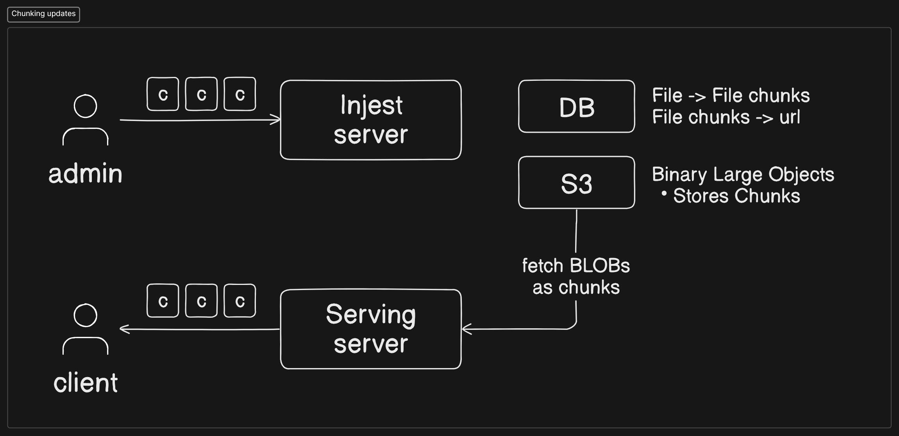

# Approach to solving the design

## A Naïve Approach


- However, this uses a 2GB bandwidth for each operation/edit
- It's also not fault tolerant
- What if the packet size is limited

## Chunking Updates

To solve the above issue we use chunking updates

- Upload 1Gb initial file
- Upload small updates -> in Chunks
  - Reduced bandwidth usage
  - Better fault tolerance



## Calculations

### Metadata

```bash
Name -> length 100 = 100bytes
Creation timestamp = 13bytes
edited timestamp   = 13 bytes
chunk data         = ...
                   < 500 bytes
```

### Results

```bash
(100M users)(10MB size)(10 files) = 10PB of file storage on S3
(100M)(500bytes metadata)(10)     = 500GB of metadata storage
(1M DAV)(100 edits)(2KB chunk)    = 200GB daily upload bandwidth

For other clients -> 200GB daily update download bandwidth
```

## Handling Subscriptions


